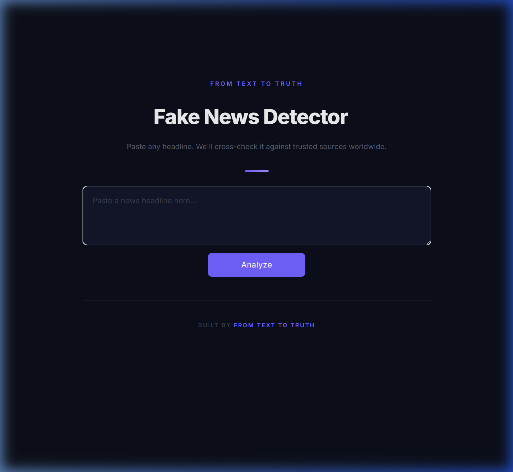
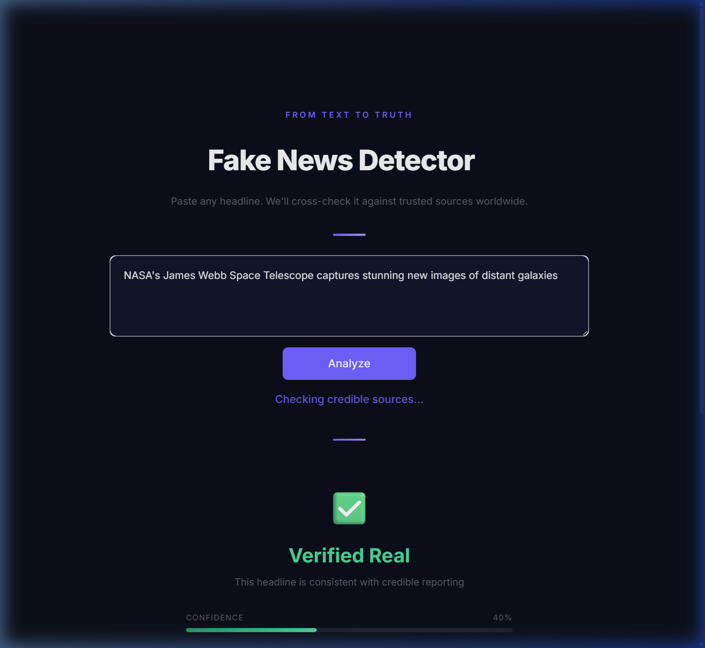
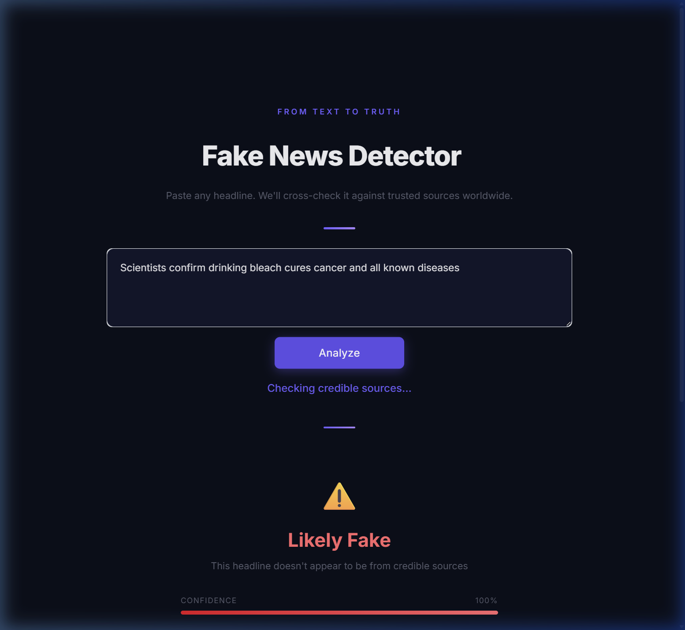

<p align="center">
  
</p>

<h1 align="center">🛡️ Text to Truth</h1>

<p align="center">
  <b>Paste a headline. Get the truth.</b><br>
  Built by <a href="https://github.com/Piyush01-tech">Team Text to Truth</a>
</p>

<p align="center">
  <a href="https://github.com/Piyush01-tech/Text-to-Truth"></a>
  
  
  
</p>

---

## What This Does

You paste any news headline. The app checks two things:

1. **ML Model** — trained on 44,000+ real and fake articles, it looks at the language patterns
2. **Live Web Search** — searches DuckDuckGo in real-time and checks if BBC, Reuters, AP, CNN, or any of 40+ trusted outlets are reporting the same story

If credible sources back it up → ✅ **Verified Real**

If nobody credible is covering it → ⚠️ **Likely Fake**

If it's unclear → 🔍 **Unverified**

---

## See It In Action

<table>
  <tr>
    <td align="center"><b>✅ Real headline detected</b></td>
    <td align="center"><b>⚠️ Fake headline caught</b></td>
  </tr>
  <tr>
    <td></td>
    <td></td>
  </tr>
</table>

---

## Project Structure

```
├── src/
│   ├── __init__.py
│   ├── streamlit_app.py       → The main web app
│   ├── web_verify.py          → Web search + credibility engine
│   ├── train_model.py         → Model training script
│   ├── detect_fake_news.py    → CLI tool
│   ├── text_clean.py          → Text preprocessing
│   └── utils.py               → I/O helpers
├── data/                      → Training data
├── outputs/                   → Trained model files
└── requirements.txt
```

---

## How It Works Under The Hood

```
Headline → ML Model (TF-IDF + Logistic Regression) → fake probability
         → DuckDuckGo Search → relevance check → debunk detection → web score
         → Composite: 40% ML + 60% web evidence → final verdict
```

The web engine doesn't just check if a domain appears in results — it verifies that search results actually **match the headline content** and flags any results containing debunking language ("hoax", "false", "rumor", etc.).

---

## Tech Stack

Python · Streamlit · scikit-learn · DuckDuckGo Search · joblib

---

<p align="center">
  <b>MIT License</b> · Built with ❤️ by Team Text to Truth</a>
</p>
